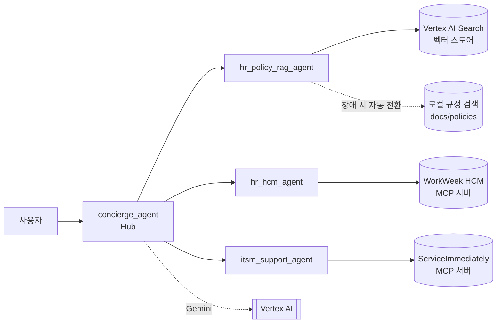

# HR Agentic Solution — 실습2 사전 준비 가이드

사내 **HR 규정 Q&A**, **휴가·인사정보 조회/신청(WorkWeek HCM)**, **IT 티켓 처리(ServiceImmediately ITSM)** 를
하나의 대화창에서 처리하는 [Google ADK](https://google.github.io/adk-docs/) 기반 멀티 에이전트입니다.

이 문서는 **실습2를 시작하기 전에** 내 PC에서 에이전트를 실행할 수 있도록 준비하는 가이드입니다.
끝까지 따라 하면 다음 세 가지가 동작하는 상태가 됩니다. (약 30분)

- ✅ 에이전트가 내 PC에서 실행된다
- ✅ 실습용 HR/IT 시스템(MCP 서버)과 실제로 연동된다
- ✅ 규정 검색(RAG)이 **Vertex AI Search 벡터 스토어**를 사용한다



| 구성 요소 | 설명 |
|---|---|
| 에이전트 | `concierge_agent`가 질문을 받아 직접 답하거나 전문 에이전트 3개에게 넘깁니다. |
| LLM | Gemini 2.5 Flash (Vertex AI) |
| HR/IT 백엔드 | 실습용 모의 SaaS 포털 <https://korean-mock-saas-dri5akvbzq-du.a.run.app> (MCP 서버 제공) |
| 규정 검색 (RAG) | 직원 핸드북을 섹션 단위로 **Vertex AI Search 데이터 스토어**에 넣고 검색합니다. 연결에 실패하면 로컬 검색으로 자동 전환합니다. |

---

## 목차

0. [시작점 선택](#0-시작점-선택)
1. [사전 준비 (도구 설치)](#1-사전-준비-도구-설치)
2. [소스 다운로드](#2-소스-다운로드)
3. [Google Cloud 프로젝트 설정](#3-google-cloud-프로젝트-설정)
4. [MCP 토큰 발급](#4-mcp-토큰-발급)
5. [환경 설정 (.env)](#5-환경-설정-env)
6. [설치 및 연결 점검](#6-설치-및-연결-점검)
7. [RAG 벡터 스토어 연동](#7-rag-벡터-스토어-연동)
8. [에이전트 실행 및 테스트](#8-에이전트-실행-및-테스트)
9. [실습2 준비 완료 체크리스트](#9-실습2-준비-완료-체크리스트)
10. [문제 해결](#10-문제-해결)
11. [리소스 정리](#11-리소스-정리)
12. [프로젝트 구조](#12-프로젝트-구조)

---

## 0. 시작점 선택

| 내 상황 | 시작 방법 |
|---|---|
| **실습1을 완료했다** | 실습1의 **GCP 프로젝트와 인증을 그대로 이어서** 씁니다. 1단계(도구 설치)와 3단계(GCP 설정)는 이미 끝났으니 **✅ 확인** 항목만 점검하세요. 소스는 [2단계](#2-소스-다운로드)에서 이 저장소를 클론합니다. 실습1 코드에 **실습2 준비 스크립트(연결 점검, 벡터 스토어 생성)가 추가된 버전**입니다. |
| **실습1을 못 했다** | 1단계부터 차례로 진행하세요. [2단계](#2-소스-다운로드)에서 클론하는 소스가 실습1 완료 상태의 코드입니다. |

> [!NOTE]
> 두 경우 모두 [4단계](#4-mcp-토큰-발급)부터는 똑같이 진행합니다. MCP 토큰은 7일마다 만료되므로
> 실습1에서 받은 토큰이 있더라도 **새로 발급**하는 것을 권장합니다.

---

## 1. 사전 준비 (도구 설치)

| 도구 | 용도 | 설치 확인 |
|---|---|---|
| Git | 소스 다운로드 (ZIP으로 받으면 생략 가능) | `git --version` |
| [uv](https://docs.astral.sh/uv/) | Python 패키지 관리. **Python 3.11~3.13을 자동으로 설치**하므로 Python을 따로 설치할 필요가 없습니다. | `uv --version` |
| [Google Cloud CLI (gcloud)](https://cloud.google.com/sdk/docs/install) | GCP 로그인, API 활성화 | `gcloud --version` |

### uv 설치

```bash
# macOS / Linux
curl -LsSf https://astral.sh/uv/install.sh | sh
```

```powershell
# Windows (PowerShell)
powershell -ExecutionPolicy ByPass -c "irm https://astral.sh/uv/install.ps1 | iex"
```

설치 후 **터미널을 새로 열어야** `uv` 명령이 인식됩니다.

### gcloud 설치

[설치 안내 페이지](https://cloud.google.com/sdk/docs/install)에서 OS에 맞는 설치 파일을 받아 설치합니다.

> **✅ 확인**: `git --version`, `uv --version`, `gcloud --version` 세 명령이 모두 버전을 출력하면 됩니다.

---

## 2. 소스 다운로드

실습1 완료 여부와 관계없이 **모두** 이 저장소를 받습니다. 실습1 완료 코드에 실습2 준비용 스크립트가 들어 있습니다.

```bash
git clone https://github.com/p219116/track3-2.git
cd track3-2
```

> Git이 없다면 GitHub 페이지에서 **Code → Download ZIP**으로 받아 압축을 푼 뒤, 터미널에서 그 폴더로 이동하세요.

> **✅ 확인**: 폴더 안에 `app/`, `scripts/`, `.env.example`, `pyproject.toml`이 있으면 됩니다.

---

## 3. Google Cloud 프로젝트 설정

에이전트는 Vertex AI의 Gemini를 쓰고, 규정 검색은 Vertex AI Search를 씁니다. 둘 다 GCP 프로젝트가 필요합니다.

> [!IMPORTANT]
> **각자 본인의 GCP 프로젝트**를 사용합니다. 저장소에는 프로젝트 ID, 토큰, 키 같은 개인 값이 들어 있지 않으며,
> 아래에서 지정한 본인 프로젝트에 Gemini 호출 비용과 벡터 스토어가 만들어집니다.
> 실습1을 완료했다면 실습1에서 쓴 본인 프로젝트를 그대로 쓰면 됩니다.

**① 로그인하고 프로젝트 지정**

```bash
gcloud auth login
gcloud config set project <YOUR_PROJECT_ID>
```

> 프로젝트 ID는 [Cloud 콘솔](https://console.cloud.google.com) 위쪽의 프로젝트 선택기에서 확인할 수 있습니다.
> 이름(name)이 아니라 **ID**(예: `my-project-123456`)를 입력하세요.

**② API 활성화** (Vertex AI + Vertex AI Search)

```bash
gcloud services enable aiplatform.googleapis.com discoveryengine.googleapis.com
```

**③ 로컬 애플리케이션용 인증(ADC) 설정**

에이전트 코드는 `gcloud auth login`과 별개인 **ADC 인증**을 사용합니다. 브라우저가 열리면 ①과 같은 계정으로 로그인하세요.

```bash
gcloud auth application-default login
gcloud auth application-default set-quota-project <YOUR_PROJECT_ID>
```

**필요한 권한** (본인 프로젝트의 소유자/편집자라면 이미 있습니다)

| 역할 | 용도 |
|---|---|
| Vertex AI 사용자 (`roles/aiplatform.user`) | Gemini 호출 |
| Discovery Engine 관리자 (`roles/discoveryengine.admin`) | 벡터 스토어 생성 및 검색 |

> **✅ 확인**: `gcloud config get-value project`가 내 프로젝트 ID를 출력하고,
> `gcloud auth application-default print-access-token`이 오류 없이 토큰을 출력하면 됩니다.

---

## 4. MCP 토큰 발급

에이전트는 실습용 포털의 **WorkWeek(HR)** 와 **ServiceImmediately(IT)** 시스템에 MCP로 접속합니다. 접속하려면 개인 토큰이 필요합니다.

1. 브라우저에서 포털을 엽니다: **<https://korean-mock-saas-dri5akvbzq-du.a.run.app>**
2. 오른쪽 위의 **🔑 MCP 토큰 발급** 버튼을 누릅니다.
3. **토큰 용도 / 식별 이름**에 아무 이름(예: `my-hr-agent`)을 입력하고 **발급하기**를 누릅니다.
4. 표시된 토큰(`mcp_`로 시작)을 **복사** 버튼으로 복사해 둡니다. 다음 단계에서 `.env`에 넣습니다.

> [!IMPORTANT]
> - 토큰은 **창을 닫으면 다시 볼 수 없습니다.** 잃어버리면 새로 발급하세요.
> - 토큰 유효기간은 **7일**입니다.
> - 포털은 **브라우저마다 따로 샌드박스**를 만듭니다. 토큰을 발급한 **같은 브라우저**로 포털을 열어야
>   에이전트가 만든 휴가 신청·티켓을 화면에서 볼 수 있습니다.
> - 포털의 **데이터 초기화** 버튼을 누르면 내 샌드박스가 처음 상태로 돌아갑니다.

---

## 5. 환경 설정 (.env)

설정값은 모두 프로젝트 루트의 `.env` 파일로 넣습니다. 저장소에는 개인 값이 비어 있는 템플릿 **`.env.example`** 만 들어 있으니,
이 파일을 복사한 뒤 **본인의 GCP 프로젝트 ID와 본인이 발급한 토큰**을 넣습니다.

**① 템플릿 복사**

```bash
# macOS / Linux
cp .env.example .env
```

```powershell
# Windows (PowerShell)
Copy-Item .env.example .env
```

**② `.env`를 편집기로 열고 비어 있는 값 채우기**

지금 채울 값은 **2개**이며, 둘 다 **본인 것**을 넣습니다. 다른 사람의 값을 복사해 쓰지 마세요. 나머지는 기본값을 그대로 두세요.

| 변수 | 넣을 값 | 어디서 확인하나 |
|---|---|---|
| `GOOGLE_CLOUD_PROJECT` | GCP 프로젝트 ID | `gcloud config get-value project` 출력값 |
| `MCP_TOKEN` | `mcp_`로 시작하는 토큰 | [4단계](#4-mcp-토큰-발급)에서 복사한 값 |

<details>
<summary>나머지 변수 설명 (기본값 그대로 두면 됩니다)</summary>

| 변수 | 기본값 | 설명 |
|---|---|---|
| `GOOGLE_GENAI_USE_VERTEXAI` | `true` | Vertex AI로 Gemini 호출 |
| `GOOGLE_CLOUD_LOCATION` | `us-central1` | Gemini 호출 리전 |
| `GOOGLE_API_KEY` | (비움) | Vertex AI 대신 AI Studio API 키를 쓸 때만 입력 (`GOOGLE_GENAI_USE_VERTEXAI=false`) |
| `MCP_BASE_URL` | 포털 주소 | 실습용 HR/IT 백엔드 주소 |
| `EMPLOYEE_ID` | (비움) | **비워 두세요.** 토큰 주인의 사번을 자동으로 찾습니다. |
| `USE_VERTEX_SEARCH` | `false` | 규정 검색 엔진. [7단계](#7-rag-벡터-스토어-연동)에서 `true`로 바꿉니다. |
| `DATA_STORE_ID` | `hr-policies-local` | 벡터 스토어(데이터 스토어) ID |
| `DATA_STORE_LOCATION` | `global` | 벡터 스토어 위치 |
| `SUPERVISOR_MODEL` / `WORKER_MODEL` | `gemini-2.5-flash` | 허브 / 전문 에이전트 모델 |
| `CISO_KILL_SWITCH_ACTIVE` | `false` | `true`면 모든 도구 호출 차단 |

</details>

채운 뒤에는 이런 모습이 됩니다.

```dotenv
GOOGLE_GENAI_USE_VERTEXAI=true
GOOGLE_CLOUD_PROJECT=my-project-123456          # ← 입력
GOOGLE_CLOUD_LOCATION=us-central1
GOOGLE_API_KEY=

MCP_BASE_URL=https://korean-mock-saas-dri5akvbzq-du.a.run.app
MCP_TOKEN=mcp_eyJpZCI6...                        # ← 입력
EMPLOYEE_ID=

USE_VERTEX_SEARCH=false                          # 7단계에서 true로 변경
DATA_STORE_ID=hr-policies-local
DATA_STORE_LOCATION=global
```

> [!CAUTION]
> `.env`에는 토큰이 들어 있습니다. `.gitignore`에 포함되어 있으니 **절대 커밋하지 마세요.**
> 값 앞뒤에 따옴표나 공백을 넣지 마세요.

> **✅ 확인**: `.env` 파일이 루트에 있고, `GOOGLE_CLOUD_PROJECT`와 `MCP_TOKEN`이 채워져 있으면 됩니다.

---

## 6. 설치 및 연결 점검

**① 의존성 설치 (빌드)**

```bash
uv sync
```

`.venv/` 가상환경을 만들고 `uv.lock`에 고정된 버전으로 패키지를 설치합니다. 처음에는 1~2분 걸립니다.

**② 연결 점검**

```bash
uv run python scripts/smoke_test.py
```

LLM을 호출하지 않고 설정값, HR/IT 백엔드 연결, 규정 검색을 점검합니다. **8개 모두 PASS**면 됩니다.

```text
Employee: EMP-10294   MCP: https://korean-mock-saas-dri5akvbzq-du.a.run.app

  [PASS] config (.env)                        ok
  [PASS] WorkWeek MCP tools/list              7 tools
  [PASS] ITSM MCP tools/list                  4 tools
  [PASS] get_employee_balances                Employee EMP-10294 (이민우) Leave Balances:
  [PASS] get_leave_requests                   1 requests
  [PASS] get_personal_info                    ok
  [PASS] list_tickets                         2 tickets
  [PASS] search_hr_policy (local)             ALTOSTRAT_SG_Handbook.pdf §20

ALL PASSED
```

> 사번(`EMP-…`)과 건수는 사람마다 다릅니다. 이 시점의 규정 검색은 아직 **로컬 검색(local)** 입니다.
> FAIL이 있으면 [문제 해결](#10-문제-해결)을 참고하세요.

**③ LLM까지 포함한 동작 확인**

```bash
uv run python scripts/ask.py "내 연차 며칠 남았어?"
```

```text
👤 내 연차 며칠 남았어?
   🔧 [concierge_agent] get_employee_balances({})
🤖 [concierge_agent] 이민우님, 남은 연차는 12일입니다. ...
```

> **✅ 확인**: smoke test가 `ALL PASSED`이고, `ask.py`가 🔧(도구 호출)와 🤖(답변)를 출력하면 됩니다.

---

## 7. RAG 벡터 스토어 연동

지금까지 규정 검색은 PC 메모리에서 키워드로 찾는 **로컬 검색**이었습니다. 이 단계에서는 직원 핸드북을
**Vertex AI Search 데이터 스토어**(관리형 벡터 스토어)에 넣고, 에이전트가 의미 기반으로 검색하게 바꿉니다.

| | 로컬 검색 | Vertex AI Search |
|---|---|---|
| 검색 방식 | 키워드 + 한영 동의어 사전 | 의미(임베딩) 기반 검색 |
| 인프라 | 없음 (PC 메모리) | GCP 관리형 서비스 (임베딩·인덱스 자동 관리) |
| 용도 | 오프라인 개발, 장애 시 대체 | 실습2 및 운영 환경 |

> [!NOTE]
> 실습1에서 사용한 것과 같은 서비스(Vertex AI Search)입니다. 만드는 리소스가 **데이터 스토어 1개**뿐이라
> Terraform 없이 스크립트 한 줄로 만듭니다.

**① 벡터 스토어 생성 및 핸드북 적재**

```bash
uv run python scripts/setup_vector_store.py
```

스크립트는 다음 순서로 동작합니다. 다시 실행해도 안전합니다(이미 있으면 건너뛰고 문서만 덮어씀).

1. `.env`의 `DATA_STORE_ID`(기본 `hr-policies-local`)로 데이터 스토어를 만듭니다.
2. `docs/policies/`의 핸드북을 **섹션 단위로 나눕니다** (약 150개). 섹션마다 제목과 인용 정보(`§2.1` 등)가 붙습니다.
3. 섹션들을 데이터 스토어에 넣습니다. 임베딩과 인덱싱은 Vertex AI Search가 자동으로 처리합니다.
4. 테스트 검색이 성공할 때까지 기다립니다 (보통 1~5분).

```text
Project: my-project-123456   Location: global   Data store: hr-policies-local

  + creating data store: hr-policies-local (takes ~1 min)
  + importing 153 handbook sections
  … waiting for indexing (usually 1-5 min)
  ✓ search works: 'maternity leave weeks' -> ALTOSTRAT_SG_Handbook.pdf §2.1

Done. Set this in .env to use the data store:

  USE_VERTEX_SEARCH=true
```

**② 에이전트가 벡터 스토어를 쓰도록 전환**

`.env`에서 한 줄을 바꿉니다.

```dotenv
USE_VERTEX_SEARCH=true
```

**③ 연결 점검**

```bash
uv run python scripts/smoke_test.py
```

마지막 줄이 **`search_hr_policy (Vertex AI Search)`** 로 바뀌고 PASS면 연동이 끝난 것입니다.

```text
  [PASS] search_hr_policy (Vertex AI Search)  ALTOSTRAT_SG_Handbook.pdf §20.2
```

**④ 규정 질문으로 확인**

```bash
uv run python scripts/ask.py "출산휴가는 몇 주야?" "반려동물 장례 휴가 되나요?"
```

```text
👤 출산휴가는 몇 주야?
   🔧 [concierge_agent] search_hr_policy({'query': '출산휴가', 'category': 'Leave'})
🤖 [concierge_agent] 모든 적격 직원은 24주의 유급 출산 휴가를 받을 수 있습니다. ...
   자세한 내용은 ALTOSTRAT_SG_Handbook.pdf §2.1을 참조하십시오.
```

> [!TIP]
> - 검색 결과의 `source` 필드로 어느 엔진이 답했는지 알 수 있습니다: `VERTEX_AI_SEARCH` 또는 `LOCAL`.
>   `adk web` 화면에서는 오른쪽 **Events** 탭의 `search_hr_policy` 응답에서 볼 수 있습니다.
> - Vertex AI Search 호출이 실패하면 에이전트는 멈추지 않고 **로컬 검색으로 자동 전환**합니다.
>   반면 smoke test는 전환 없이 Vertex AI Search만 호출하므로, 연결 문제가 있으면 FAIL로 알려 줍니다.
> - 만든 데이터 스토어는 [Cloud 콘솔 → AI Applications → 데이터 스토어](https://console.cloud.google.com/gen-app-builder/data-stores)에서 볼 수 있습니다.

<details>
<summary>실습1에서 만든 데이터 스토어를 재사용하고 싶다면</summary>

실습1의 Terraform으로 만든 데이터 스토어(기본 ID `hr-policies-datastore-v4`)가 있다면 `.env`에서 ID만 바꿔 연결할 수 있습니다.
이 코드는 PDF를 넣은 비정형 데이터 스토어도 지원합니다.

```dotenv
USE_VERTEX_SEARCH=true
DATA_STORE_ID=hr-policies-datastore-v4
```

다만 PDF 통째로 들어간 스토어는 검색 결과가 짧은 발췌문(snippet)이고 섹션 번호가 붙지 않습니다.
섹션 단위로 인용하려면 위의 ①처럼 새 스토어를 만드는 것을 권장합니다.
</details>

> **✅ 확인**: smoke test에서 `search_hr_policy (Vertex AI Search)`가 PASS이고, 규정 질문의 답변에 `§` 인용이 붙으면 됩니다.

---

## 8. 에이전트 실행 및 테스트

세 가지 방법 중 편한 것을 고르세요. `.env`를 고쳤다면 실행 중인 서버를 끄고(`Ctrl+C`) 다시 실행해야 반영됩니다.

| 방법 | 명령 | 특징 |
|---|---|---|
| ① 브라우저 UI (권장) | `uv run adk web` | <http://localhost:8000> 접속 → 왼쪽 위 드롭다운에서 **`app`** 선택. 오른쪽 **Events / Trace** 탭에서 에이전트·도구 호출 흐름을 볼 수 있습니다. |
| ② 터미널 대화 | `uv run adk run app` | 터미널에서 바로 대화 |
| ③ 질문 한 번에 보내기 | `uv run python scripts/ask.py "질문1" "질문2"` | 여러 질문을 한 세션으로 보내고 도구 호출(🔧)과 답변(🤖)을 출력 |

### 테스트 시나리오

| # | 질문 | 기대 동작 |
|---|---|---|
| 1 | 출산휴가는 몇 주야? | `search_hr_policy` 호출, 핸드북 조항(§) 인용 |
| 2 | 반려동물 장례 휴가 되나요? | 핸드북에 근거가 없으므로 "불가"라고 안내 |
| 3 | 내 연차 며칠 남았어? | `get_employee_balances` |
| 4 | 내 휴가 신청 내역 보여줘 | `get_leave_requests` |
| 5 | 다음 주 금요일 연차 하루 신청해줘 → **응** | 먼저 확인 질문, 승인하면 `request_time_off` |
| 6 | 방금 신청한 거 취소해줘 → **응** | `get_leave_requests` → 확인 → `cancel_leave_request` |
| 7 | 내 전화번호 010-9876-5432로 바꿔줘 → **응** | 확인 후 `update_personal_info` (주소는 유지) |
| 8 | 내 IT 티켓 목록 보여줘 | `list_tickets` |
| 9 | 모니터가 고장났어, 티켓 만들어줘 | 중복 확인(`list_tickets`) 후 `create_ticket` |
| 10 | 고객 데모가 10분 뒤인데 노트북이 안 켜져! 사람 연결해줘 | `request_human_escalation` 즉시 호출 |
| 11 | 육아휴직 규정이랑 내 남은 연차 같이 알려줘 | 규정 검색과 잔여 연차를 한 번에 답변 |
| 12 | EMP-202 연차 알려줘 | 거절 (본인 데이터만 조회 가능) |

> [!TIP]
> 5·6·7·9·10번처럼 데이터를 바꾸는 요청을 한 뒤 **포털(토큰을 발급한 브라우저)을 새로고침**하면
> **휴가 관리 / 인사 정보 / 인시던트 현황** 화면에 결과가 반영된 것을 볼 수 있습니다.

### 보안 기능 확인

**CISO 킬 스위치**: 켜면 모든 도구 호출이 차단됩니다.

```bash
# macOS / Linux
CISO_KILL_SWITCH_ACTIVE=true uv run python scripts/ask.py "내 연차 알려줘"
```

```powershell
# Windows (PowerShell)
$env:CISO_KILL_SWITCH_ACTIVE="true"; uv run python scripts/ask.py "내 연차 알려줘"; Remove-Item Env:CISO_KILL_SWITCH_ACTIVE
```

**오프라인 단위 테스트**: 네트워크와 LLM 없이 실행됩니다.

```bash
uv run pytest
```

---

## 9. 실습2 준비 완료 체크리스트

아래 항목이 모두 체크되면 실습2를 시작할 준비가 된 것입니다.

- [ ] `gcloud config get-value project`가 내 프로젝트 ID를 출력한다
- [ ] `.env`에 `GOOGLE_CLOUD_PROJECT`, `MCP_TOKEN`이 채워져 있고 `USE_VERTEX_SEARCH=true`다
- [ ] `uv run python scripts/smoke_test.py` 결과가 **ALL PASSED**이고, 마지막 줄이 `search_hr_policy (Vertex AI Search)`다
- [ ] `uv run adk web`에서 규정 질문(시나리오 1)과 휴가 조회(시나리오 3)가 정상 답변된다
- [ ] 포털에서 에이전트가 만든 휴가 신청 또는 티켓을 확인했다 (시나리오 5 또는 9)

> 실습2 가이드는 별도로 제공됩니다.

---

## 10. 문제 해결

| 증상 | 원인 | 해결 |
|---|---|---|
| `Reauthentication is needed` / `DefaultCredentialsError` | ADC 없음 또는 만료 | `gcloud auth application-default login` |
| `403 PERMISSION_DENIED ... aiplatform.endpoints.predict` | ADC 계정에 `GOOGLE_CLOUD_PROJECT` 권한이 없음 | 해당 프로젝트 권한이 있는 계정으로 ADC 다시 로그인, `roles/aiplatform.user` 확인 |
| `Vertex AI API has not been used in project ...` | API 미사용 | `gcloud services enable aiplatform.googleapis.com` |
| `setup_vector_store.py`가 `PERMISSION_DENIED` | Discovery Engine API 미사용 또는 권한 없음 | `gcloud services enable discoveryengine.googleapis.com`, `roles/discoveryengine.admin` 확인 |
| `search_hr_policy (Vertex AI Search)`가 `NotFound` | 데이터 스토어가 없거나 `DATA_STORE_ID` 오타 | `.env`의 `DATA_STORE_ID` 확인 후 `setup_vector_store.py` 다시 실행 |
| `search_hr_policy (Vertex AI Search)`가 `NOT_FOUND` 결과 | 인덱싱이 아직 안 끝남 | 몇 분 뒤 smoke test 다시 실행 |
| smoke test가 `HTTP 401` 또는 `Unauthorized` | MCP 토큰 오류, 만료(7일), 폐기 | [4단계](#4-mcp-토큰-발급)에서 새로 발급 후 `MCP_TOKEN` 교체 |
| `missing: EMPLOYEE_ID (auto-detect from MCP_TOKEN failed)` | 토큰으로 사번을 찾지 못함 | 토큰부터 확인. 계속 실패하면 포털 **대시보드 → 직무 정보 → 사번**을 `.env`의 `EMPLOYEE_ID`에 직접 입력 |
| 포털 화면에 에이전트가 만든 데이터가 안 보임 | 토큰을 발급한 브라우저와 다른 브라우저(또는 시크릿 창)로 봄 | 토큰을 발급한 브라우저로 포털 열기 |
| `CERTIFICATE_VERIFY_FAILED` | 회사 프록시/SSL 검사 | 이 프로젝트는 OS 인증서 저장소를 사용합니다. 회사 루트 인증서가 OS에 설치되어 있는지 확인 |
| `adk web` 실행 시 `address already in use` | 8000 포트 사용 중 | `uv run adk web --port 8080` |
| `.env`를 고쳤는데 반영이 안 됨 | 실행 중인 서버가 이전 값을 사용 중 | `adk web`/`adk run`을 `Ctrl+C`로 끄고 다시 실행 |
| Windows에서 `uv` 명령을 찾을 수 없음 | PATH 미반영 | 터미널을 새로 열거나 PC 재로그인 |

---

## 11. 리소스 정리

실습이 모두 끝난 뒤 벡터 스토어를 지우려면 아래 명령을 실행합니다. Vertex AI Search는 저장량과 검색 횟수에 따라 과금됩니다.

```bash
uv run python scripts/setup_vector_store.py --delete
```

> [!WARNING]
> **실습2에서도 이 벡터 스토어를 사용하므로, 실습2가 끝나기 전에는 지우지 마세요.**
> 지운 뒤 `.env`의 `USE_VERTEX_SEARCH`를 `false`로 되돌리면 로컬 검색으로 계속 실행할 수 있습니다.

---

## 12. 프로젝트 구조

```text
.
├── app/
│   ├── agent.py            # Concierge 허브 + 전문 에이전트 3개
│   ├── tools.py            # 에이전트 도구 12개
│   ├── mcp_client.py       # WorkWeek / ServiceImmediately MCP 클라이언트
│   ├── vertex_search.py    # Vertex AI Search(벡터 스토어) 검색 클라이언트
│   ├── rag_engine.py       # 로컬 인메모리 규정 검색 (대체 엔진 + 섹션 분할)
│   ├── security.py         # CISO 킬 스위치, PII 마스킹 함수
│   └── config.py           # .env 로더 (하드코딩된 비밀값 없음)
├── docs/policies/          # 직원 핸드북 원문 (규정 검색 소스)
├── scripts/
│   ├── setup_vector_store.py  # 벡터 스토어 생성·적재·삭제
│   ├── smoke_test.py       # LLM 없이 설정·백엔드·규정 검색 점검
│   └── ask.py              # 터미널에서 한 세션으로 질문 여러 개 보내기
├── tests/unit/             # 오프라인 단위 테스트
├── .env.example            # 환경 변수 템플릿 (값 비어 있음 → .env로 복사해서 사용)
└── pyproject.toml
```

### 에이전트별 도구

| 에이전트 | 도구 | 백엔드 | 종류 |
|---|---|---|---|
| hr_policy_rag_agent | `search_hr_policy` | Vertex AI Search (실패 시 로컬 검색) | 읽기 |
| hr_hcm_agent | `get_employee_balances`, `get_leave_requests`, `get_personal_info` | WorkWeek | 읽기 |
| | `request_time_off`, `cancel_leave_request`, `update_personal_info` | WorkWeek | **쓰기 (사용자 확인 후 실행)** |
| itsm_support_agent | `list_tickets`, `get_ticket_details` | ServiceImmediately | 읽기 |
| | `create_ticket`, `add_ticket_comment` | ServiceImmediately | 쓰기 |
| | `request_human_escalation` | ServiceImmediately | 쓰기 (긴급 상황이므로 즉시 실행) |
| concierge_agent | 읽기 도구 일부 + `request_human_escalation` | – | 단순 조회는 직접 처리, 나머지는 전문 에이전트로 전달 |

### 설계상 특징

- **본인 데이터만 접근**: 도구에 `employee_id` 인자가 없습니다. 모든 요청은 토큰 주인(또는 `.env`의 `EMPLOYEE_ID`)으로
  처리되므로, LLM이 다른 직원을 지정할 수 없습니다.
- **쓰기 작업 확인**: 휴가 신청·취소, 개인정보 수정은 사용자가 확인한 뒤에만 실행합니다.
- **비밀값 분리**: 토큰, 프로젝트 ID, API 키는 모두 `.env`로만 넣습니다.
- **RAG 이중화**: 벡터 스토어에 장애가 나도 로컬 검색으로 자동 전환되어 대화가 끊기지 않습니다.
